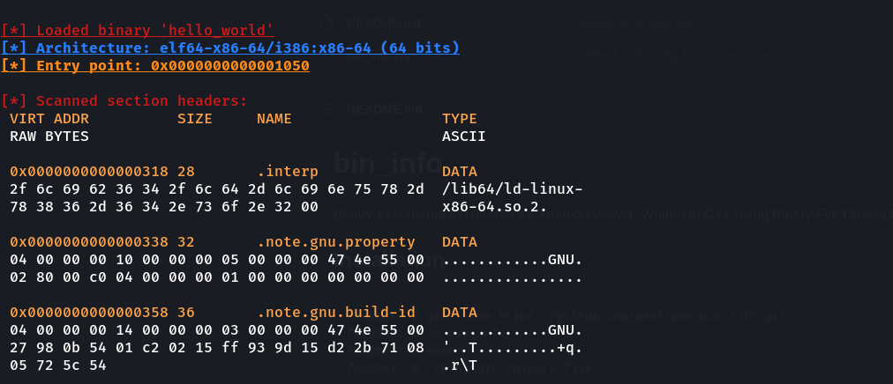
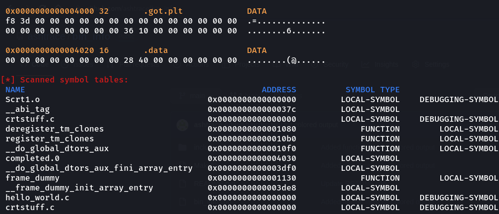

# bin_info
Binary executable file header information viewer. Written in C++ using Binary File Descriptor library.

## Installation
```bash
foo@bar:~$ git clone https://github.com/ashtrace/bin_info.git
foo@bar:~$ cd bin_info
foo@bar:~$ make
foo@bar:~$ ./bin_info <binary_file>
```
## Output
### Section Header
<p align="center">
  <kbd>
    
  </kbd>
</p>


### Symbol Table
<p align="center">
  <kbd>
    
  </kbd>
<p>
