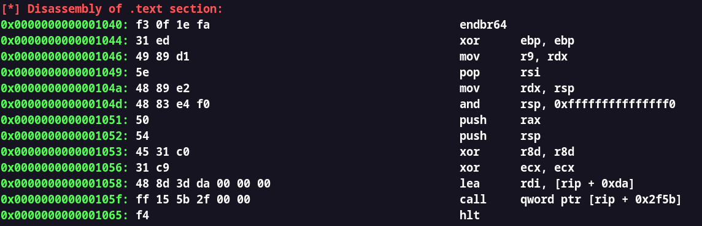

# bin_info
Binary executable file header information viewer written in C++
It uses Binary File Descriptor library (libbfd) for parsing the executable and Capstone (libcaptone) for disassembly.

## Installation
```bash
foo@bar:~$ git clone https://github.com/ashtrace/bin_info.git
foo@bar:~$ cd bin_info
foo@bar:~$ make
foo@bar:~$ ./bin_info -f <binary_file> -x # examine the header
foo@bar:~$ ./bin_info -f <binary_file> -l # perform linear disassembly
```
## Output
### Section Header
<p align="center">
  <kbd>
    
  </kbd>
</p>


### Symbol Table
<p align="center">
  <kbd>
    
  </kbd>
<p>

### Linear Disassembly
<p align="center">
  <kbd>
    
  </kbd>
<p>
